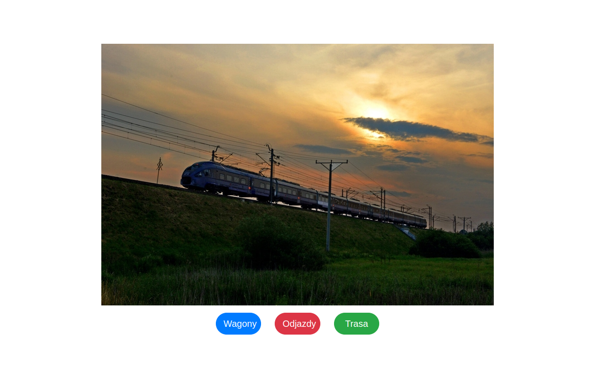
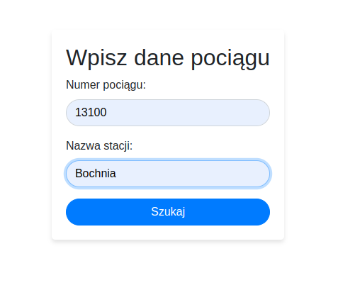
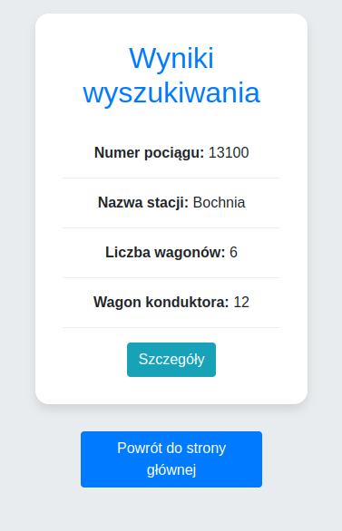
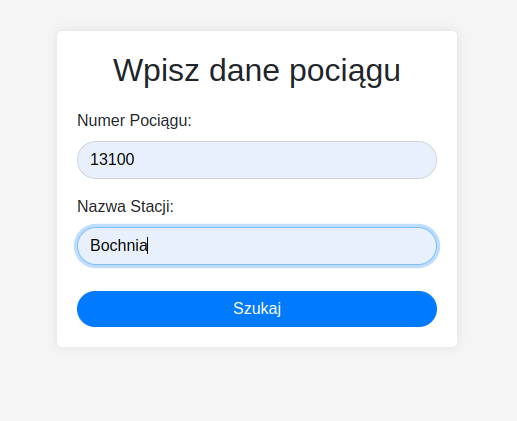
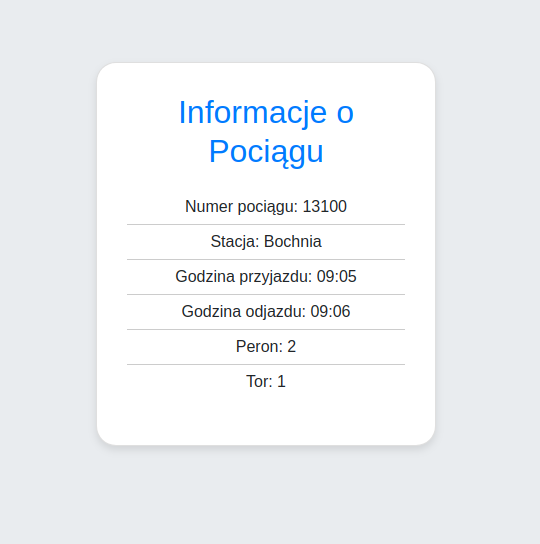
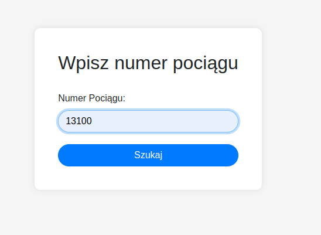
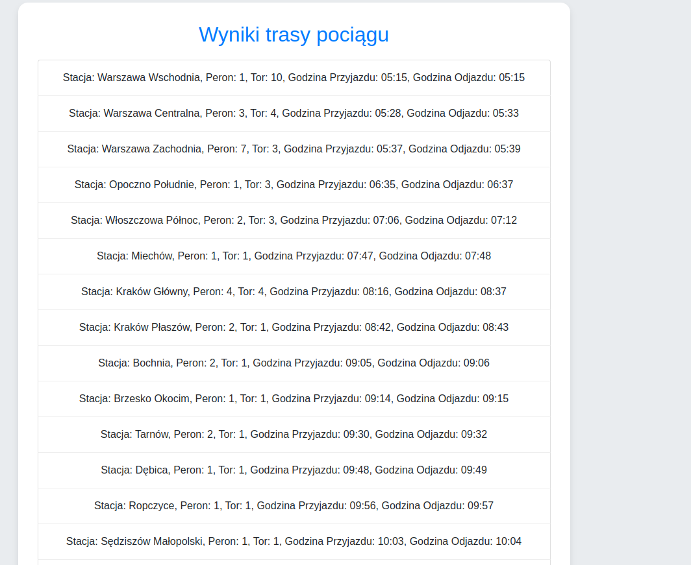

# Data Protection Project
An app under development that will be used to find train information.

## Table of contents
* [General info](#general-info)
* [Technologies](#technologies)
* [Setup](#setup)
* [Functionality](#functionality)
* [Planned changes](#planned-changes)
* [Illustrations](#illustrations)

 
## Introduction 
The app will make it possible to find information about the time and place of a train's departure, which carriages a particular
train consists of and the route of a particular train. The purpose of the app is to learn about new technologies.
## Technologies:

* blinker 1.7.0
* click 8.1.7
* Flask 3.0.2
* greenlet 3.0.3
* itsdangerous 2.1.2
* Jinja2 3.1.3
* MarkupSafe 2.1.5
* numpy 1.26.3
* SQLAlchemy 2.0.29
* typing_extensions 4.10.0
* Werkzeug 3.0.1

## Setup

Activate Virtual Envirement

Install the required components:

``` pip install -r requirements.txt ```

Then:

``` python main.py ```
 
## Functionality
The system user will have the ability to check:

- **Platform and Track Departure**
- **Train Route**
- **Train Composition**:
  - The number and types of cars that make up the train.
  - Presence of a dining car.
  - Location of compartment-less and compartment cars.
- **Car Class**
- **Conductor's Compartment**
- **Arrival and Departure Times**
- **Type of Locomotive**


## Planned changes:
### User Interface Enhancements:
- **Improved Interface View**: Enhanced clarity and usability of the interface.
- **Dark/Light Theme**: Ability to switch between dark and light interface themes.

### Database Operation Improvements:
- **Enhanced Database Performance**: Optimized queries and faster database response times.

### Additional Features:
- **Language Option**: Adding the ability to change the interface language for the user.


## Illustrations:

### Home Page


###  Train carriages
<div style="display: flex; align-items: center; justify-content: center;">
  
  
</div>


### Train Departures
<div style="display: flex; align-items: center; justify-content: center;">
  
  
</div>


### Train route
<div style="display: flex; align-items: center; justify-content: center;">
  
  
</div>
